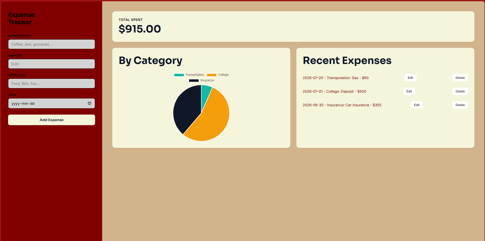

# Expense Tracker

A full-stack expense tracking app that lets you add, edit, delete, and visualize your spending by category. Built as a learning project to practice full-stack development with a C#/.NET backend and a vanilla JavaScript frontend.


*(Add a screenshot of your app here — take one after your next run and save it as `screenshot.png` in this folder)*

## Features

- **Add, edit, and delete expenses** — full CRUD functionality
- **Monthly total** — automatically calculated from all logged expenses
- **Category breakdown chart** — interactive pie chart powered by Chart.js
- **Persistent storage** — all data saved to a SQLite database via Entity Framework Core
- **REST API** — built with ASP.NET Core, documented and testable via Swagger

## Tech Stack

**Backend**
- C# / ASP.NET Core Web API
- Entity Framework Core
- SQLite

**Frontend**
- HTML, CSS, JavaScript (vanilla, no framework)
- Chart.js for data visualization
- Fetch API for communicating with the backend

## Project Structure

```
expense-tracker/
├── backend/          # ASP.NET Core Web API project
│   ├── Controllers/
│   │   └── ExpensesController.cs
│   ├── Models/
│   │   └── Expense.cs
│   ├── Data/
│   │   └── AppDbContext.cs
│   └── Program.cs
├── frontend/         # Static frontend files
│   ├── index.html
│   ├── style.css
│   └── script.js
└── README.md
```

## Getting Started

### Prerequisites
- [.NET SDK](https://dotnet.microsoft.com/download) (8.0 or later)
- A modern web browser
- (Optional) [VS Code](https://code.visualstudio.com/) with the Live Server extension, or any local server tool, to run the frontend

### Running the backend
1. Navigate to the `backend` folder
2. Restore dependencies and apply database migrations:
   ```bash
   dotnet restore
   dotnet ef database update
   ```
3. Run the API:
   ```bash
   dotnet run
   ```
4. The API will start locally (check your terminal output for the exact port) and Swagger docs will be available at `/swagger`

### Running the frontend
1. Open the `frontend` folder in your editor
2. Update the `API_URL` constant at the top of `script.js` to match your backend's port
3. Open `index.html` with a local server (e.g., Live Server in VS Code) — opening the file directly may cause CORS issues

## API Endpoints

| Method | Endpoint              | Description              |
|--------|------------------------|---------------------------|
| GET    | `/api/expenses`        | Get all expenses          |
| POST   | `/api/expenses`        | Create a new expense      |
| PUT    | `/api/expenses/{id}`   | Update an existing expense|
| DELETE | `/api/expenses/{id}`   | Delete an expense         |

## What I Learned

- Building a REST API from scratch with ASP.NET Core, including routing, controllers, and dependency injection
- Using Entity Framework Core to map C# classes to a database and manage schema changes through migrations
- Connecting a separate frontend to a backend API using `fetch()`, including handling CORS
- Debugging real-world issues like connection errors, mismatched ports, and CORS policy violations by reading browser console and network logs
- Structuring a full-stack project with a clear separation between backend and frontend
- Using Chart.js to turn raw data into a readable visualization

## Future Improvements

- User authentication so multiple people can track expenses separately
- Budgets per category with alerts when nearing a limit
- Recurring expense support
- CSV export/import
- Deployment to a live hosting service

## Author

Built by [Your Name] as a personal learning project.
